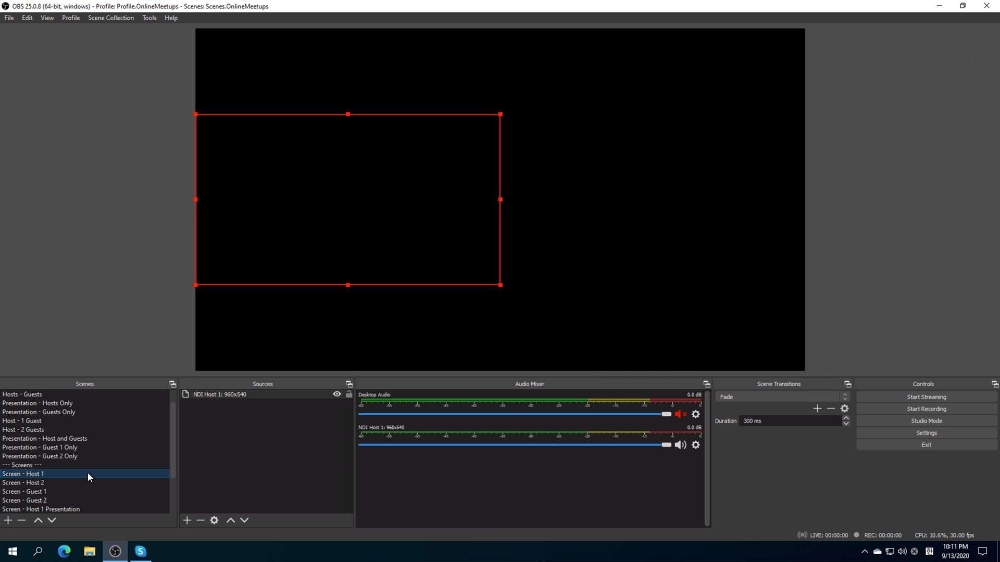
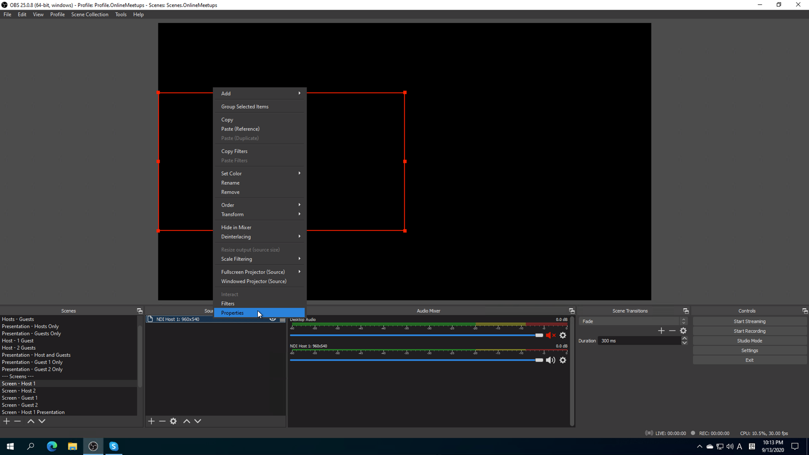
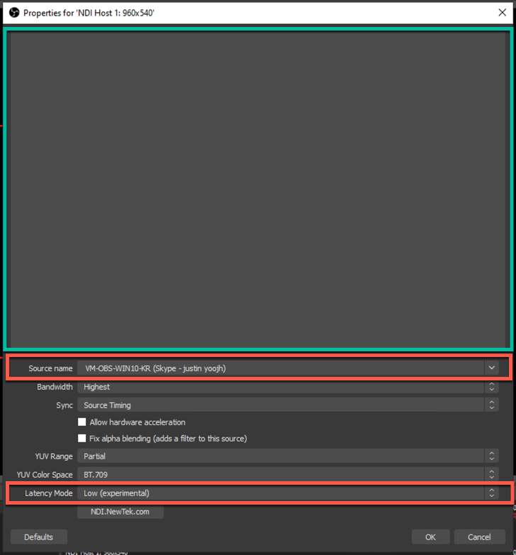
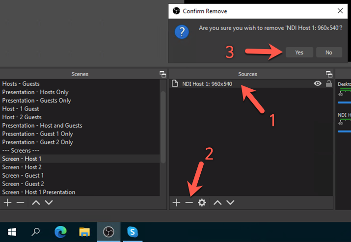
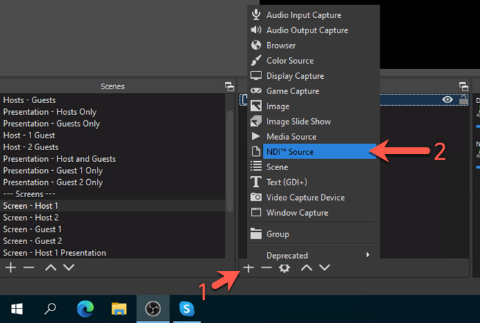
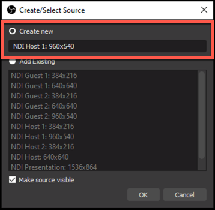
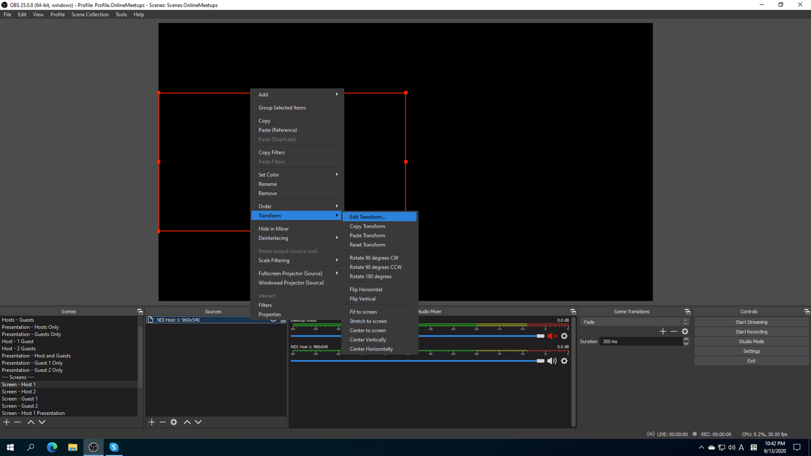
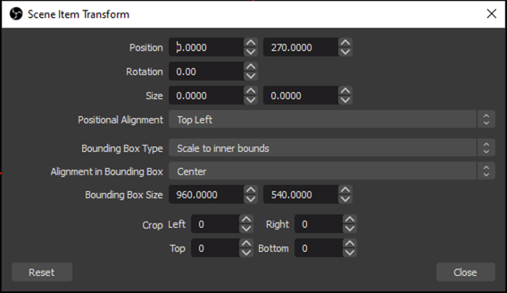

# 밋업 진행중 매뉴얼 #

## 범위 ##

이 매뉴얼은 밋업 시작전 1시간부터 밋업 종료후 1시간 까지의 시간대를 다룹니다.

## 밋업 시작 전 (M - 60) ##

### 운영자 1 ###

* 운영자 1 계정으로 자신의 PC에서 Skype에 접속한다. 반드시 앱으로 접속해야 한다.
* 가상 머신에 접속해서 Skype에 접속한다.
* OBS를 열고 자신의 웹캠과 화면 공유가 잘 나오는지 확인한다.
* 만약 웹캠이 보이지 않을 경우 아래와 같이 조치한다.
  * 좌측 하단의 Scenes 에서 `Screen - Host 1`을 선택한다.

    

  * 옆의 Sources 에서 `NDI Host 1: 960x540`을 선택한다.

    

  * Properties를 선택한다. Source name 필드에 운영자 1의 Skype ID를 찾아 선택한다. 녹색 사각형 영역에 운영자 1의 웹캠이 나타날 것이다. 하단의 Latency mode 값이 `Low (experimental)`인지 확인한다.

    

* 만약 위와 같이 조치했는데도 웹캠 화면이 나타나지 않는다면 `NDI Host 1: 960x540` 소스를 삭제하고 새로 만든다.
  * `NDI Host 1: 960x540` 소스를 선택한 후 아래의 `-` 버튼을 클릭해서 삭제한다.

    

  * Sources 섹션 하단의 `+` 버튼을 클릭한 후 `NDI Source`를 선택한다.

    

  * `NDI Host 1: 960x540` 이름으로 새로 만든다.

    

  * 앞서와 동일한 화면이 나타난다. 운영자 1의 Skype ID를 찾아 선택한다. 녹색 사각형 영역에 운영자 1의 웹캠이 나타날 것이다. 하단의 Latency mode 값이 `Low (experimental)`인지 확인한다.

    

  * 이번에는 Properties 대신 `Transform > Edit Transform`을 선택한다.

    

  * 아래와 같이 값을 입력한다.

    

    * Position: 0 | 270
    * Rotation: 0
    * Size: 0 | 0
    * Positional Alignment: Top Left
    * Bounding Box Type: Scale to inner bounds
    * Alignment in Bounding Box: Center
    * Bounding Box Size: 960 | 540
    * Crop Left: 0, Right: 0, Top: 0, Bottom: 0

  * 위 내용을 Scenes의 `Screen - Host 1 Presentation`, Sources의 `NDI Host 1: 384x216`에서 반복한다. 단, Transform 값은 아래를 따른다.
    * Position: 1536 | 864
    * Rotation: 0
    * Size: 0 | 0
    * Positional Alignment: Top Left
    * Bounding Box Type: Scale to inner bounds
    * Alignment in Bounding Box: Center
    * Bounding Box Size: 384 | 216
    * Crop Left: 0, Right: 0, Top: 0, Bottom: 0

### 운영자 2 ###

* 운영자 2의 계정으로 자신의 PC에서 Skype에 접속한다. 반드시 앱으로 접속해야 한다.
* 운영자 1은 운영자 2의 계정이 OBS에서 제대로 보이는지 확인한다. 만약 보이지 않는다면, 위와 동일하게 조치한다.
  * Scenes 에서 `Screen - Host 2`, Sources 에서 `NDI Host 2: 960x540`을 선택해서 진행한다.
  * Scenes 에서 `Screen - Host 2 (Right)`, Sources 에서 `NDI Host 2 Right: 960x540`을 선택해서 진행한다.
  * 또한 Scenes 에서 `Screen - Host 2 Presentation`, Sources 에서 `NDI Host 1: 384x216`을 선택해서 진행한다.

## 밋업 시작 전 (M - 30) ##

* 발표자 모두 Skype에 접속한다. 만약 발표자 접속이 늦어질 경우 다시 한 번 확인한다.
* 발표자 화면이 보이지 않을 경우 다시 위의 프로세스를 반복한다.
  * Scenes의 `Screen - Guest 1`, Sources의 `NDI Guest 1: 960x540`
  * Scenes의 `Screen - Guest 2`, Sources의 `NDI Guest 2: 960x540`
  * Scenes의 `Screen - Guest 1 Presentation`, Sources의 `NDI Guest 1: 384x216`
  * Scenes의 `Screen - Guest 2 Presentation`, Sources의 `NDI Guest 2: 384x216`

## 밋업 시작 전 (M -5) ##

* OBS로 스트리밍을 시작한다.
* 스트리밍 화면은 Scenes 에서 `Intro`로 맞춰 놓는다. 음성은 나가지 않고 슬라이드 쇼 형태의 이미지 로테이션만 진행된다.

## 밋업 시작 (M - 0) ##

밋업이 시작됐다!

* 운영자 1이 호스트 1이 되어 얘기하는 시점에서는 운영자 2가 오퍼레이터가 되어 가상 머신에 접속한 후 OBS를 제어한다.
* 운영자 2가 호스트 2가 되어 얘기하는 시점에서는 운영자 1이 오퍼레이터가 되어 가상 머신에 접속한 후 OBS를 제어한다.

### OBS 제어 ###

* 밋업 시작 5분 전부터 이미 스트리밍은 시작됐다. 현재 Scenes에서 `Intro`가 나가는 중이다.
* 호스트와 게스트 모두 준비가 됐으면 이제 Scenes의 `Hosts - Guests`를 선택한다.
  * Sources 에서는 현재 말하는 사람들을 선택한다. 가능한 조합은 아래와 같다.
    * 호스트 1 - 호스트 2 (Right)
    * 호스트 1 - 게스트 1
    * 호스트 1 - 게스트 2
    * 호스트 2 - 게스트 1
    * 호스트 2 - 게스트 2
  * 선택되지 않은 사람의 마이크는 자동으로 음소거가 되므로 신경 쓰지 않아도 된다.
* 호스트가 프레젠테이션 하는 경우에는 Scenes의 `Presentation - Hosts Only`을 선택하고 현재 말하고자 하는 사람을 Sources에서 눈 모양을 클릭하여 활성화 시킨다.
* 게스트가 프레젠테이션 하는 경우에는 Scenes의 `Presentation - Guests Only`을 선택하고 현재 말하고자 하는 사람을 Sources에서 눈 모양을 클릭하여 활성화 시킨다.

## 밋업 종료 ##

밋업 종료후 스트리밍을 끝낸다. 자동으로 유튜브 채널에 저장된다. 이를 다운로드 받아 편집한 후 다시 게시한다.
